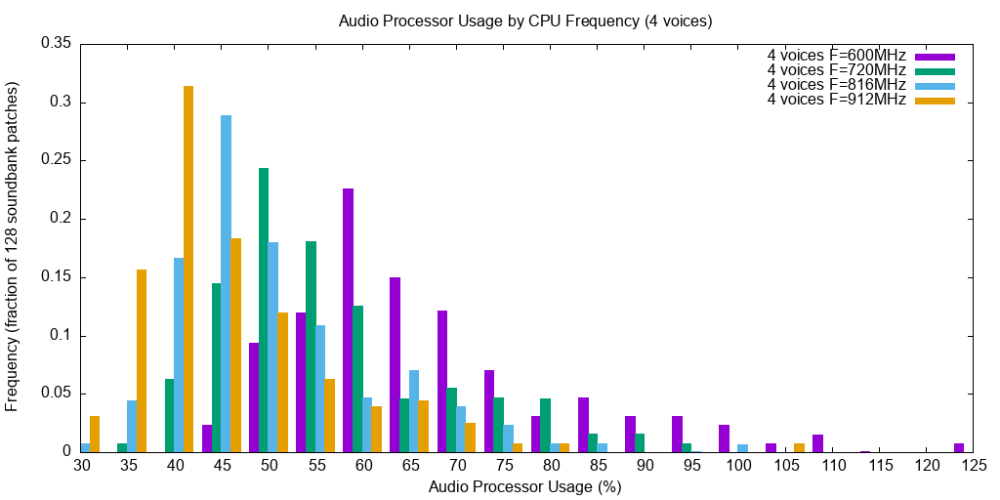
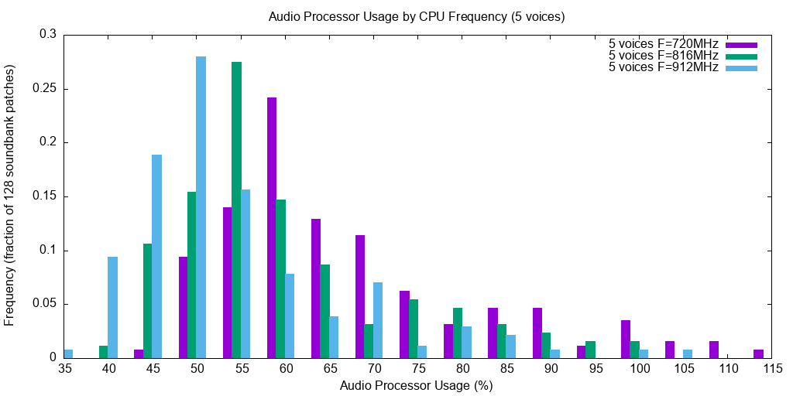
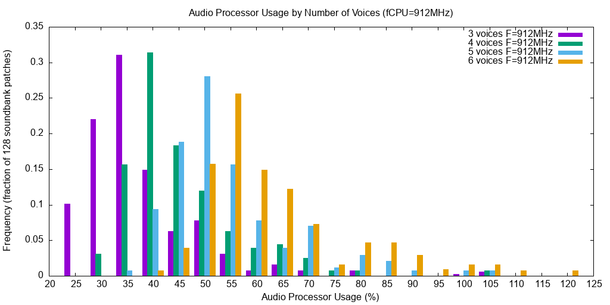

This is a port of the  [TAL-NoiseMaker](https://tal-software.com/products/tal-noisemaker) virtual analog synthesizer to the [Teensy Audio Library](https://www.pjrc.com/teensy/td_libs_Audio.html) . NoiseMaker is a  desktop synthesizer plugin with relatively low CPU usage, which can sound quite good on a [Teensy 4.1 microcontroller](https://www.pjrc.com/store/teensy41.html). Features in this version:

* Three oscillators per voice: two general oscillators with various waveforms (saw, pulse, noise, triangle, sine, rectangle) and one sub-oscillator (rectangle only).
* Ring modulation, pulse modulation and frequency/phase modulation.
* Up to 6 voices can be achieved for most settings with overclocking.
* Self-resonating 4x oversampled filters sound great and are very stable.
* Separate Volume and Filter ADSR envelopes.
* A chorus modelled on the Roland Juno
* A reverb
* A library of 128 factory presets

This code is based on NoiseMaker version 1.02 which was released by Patrick Kunz [on Sourceforge](https://sourceforge.net/projects/tal-noisemak3r/). The original code uses the [JUCE](https://juce.com/) library to provide VST and AU versions of the synthesizer with a portable GUI. This Teensy version instead provides an AudioStream object with stereo output, which can be incorporated in an audio flow graph.

[Benchmarking of the factory soundbank](#benchmark) shows that at least 4 voices can be expected at standard 600MHz CPU frequency, with 5 voices at 720-816MHz, and 6 voices at 912MHz and above. This is for the most demanding patches, with the majority of the patches performing much better than that.

This [minimal example](examples/Minimal/Minimal.ino) plays a 2 octave chromatic scale using a percussive synth voice:

```c++
#include <Audio.h> 
#include <NoiseMaker.h>

AudioControlSGTL5000 sgtl5000;        // SGTL5000 controller for Teensy Audio 4 board
NoiseMaker noisemaker(true);          // NoiseMaker synth with reverb enabled
AudioOutputI2S i2s1;                  // Audio output sink
AudioConnection patchCord1(noisemaker, 0, i2s1, 0);
AudioConnection patchCord2(noisemaker, 1, i2s1, 1);

void setup(void) {
    Serial.begin(115200);
    noisemaker.setProgram(64);        // select preset "DR Perc Bongo Room" from sound library
    AudioMemory(10);
    sgtl5000.enable();                // start processing audio
    sgtl5000.volume(0.8);   
}

/* Play a two octave chromatic scale */

uint8_t i = 0;
uint8_t note = 0;

void loop(void) {
    AudioNoInterrupts();              // disable audio interrupts to control the noisemaker engine
    SynthEngine * engine = noisemaker.engine;
    if (note)                         // turn of previous note, if any
        engine -> setNoteOff(note);
    note = 64 + i;
    engine -> setNoteOn(note, 1);     // turn on next note. Velocity is in range 0..1
    AudioInterrupts();
    Serial.printf("Note %d\n", note);
    i = (i+1) % 24;                   // advance to next note in cycle
    delay(500);
}
```

## Programming API

Include this library using `#include <NoiseMaker.h>`. This provides a  [`NoiseMaker`](NoiseMaker.h)  class which can be used with the Teensy Audio Library as a standard `AudioStream`, providing left and right audio outputs. The `engine` attribute exposes the underlying TAL [`SynthEngine` object](Engine/SynthEngine.h) which can be used to start and stop notes, and to adjust the synthesis parameters.
<dl>
<dt><strong>engine->setNoteOn(note, velocity)</strong></dt>
<dd>Start playing MIDI <strong>note</strong> with <strong>velocity</strong> specified in the range 0..1</dd>

<dt><strong>engine->setNoteOff(note, velocity)</strong></dt>
<dd>Stop playing MIDI <strong>note</strong> with <strong>velocity</strong> specified in the range 0..1</dd>
</dl>

The `SynthEngine` object allows modification of all of the synth parameters, including modulation via individual methods. Most parameters can also be set via the `NoiseMaker` <strong>setParameter(index, value)</strong> method, where <strong>index</strong> is one of the constants in the [`SYNTHPARAMETERS` enum](Engine/Params.h), and <strong>value</strong> is in the range 0..1. A corresponding <strong>getParameter(index)</strong> retreives the value of the parameter.

A library of 128 factory sounds is provided. Use the <strong>setProgram(program, nVoices)</strong> method, where <strong>program</strong> is the program number in the range 0..127. The <strong>nVoices</strong> parameter optionally overrides the default number of voices when set non-zero.

While using `NoiseMaker` or `SynthEngine` objects it is recommended to disable audio interrupts by enclosing the code block between `AudioNoInterrupts()` and `AudioInterrupts()`. This avoids the possibility of unsafe concurrent modification in the background audio thread.

## Examples

These examples run on a Teensy 4.1 attached to a Teensy Audio Adapter board. You can modify the audio setup code for other output options. For overclocking, a small heatsink was attached to the CPU.

### Benchmark

The [`Benchmark`](examples/Benchmark/Benchmark.ino) example loops through each of the factory sounds, and measures the processor usage (using AudioProcessorUsageMax) for variable number of notes sounding. The entire factory bank is also evaluated for different CPU clock rates, which shows roughly how performance will improve with over-clocking the Teensy.

The parameter `nVoices` controls the number of notes that will play simultaneously during the tests. When set to zero the default number of voices for each patch will be used. This varies between 1 (mono patches such as bass and drums) and 6 which is the maximum specified in the original factory bank. When set to non-zero, `nVoices` is used for the maximum number of notes regardless of the patch settings. Note that some patches with the default voices can overload a Teensy at 600MHz, causing the test to stall (eg. the "FX" patches #68, #70, #78, #83). Set `avoidOverload` true to apply a conservative maximum number of voices (4 at 600MHz, 5 at 720MHz and 816MHz, and 6 at 912MHz) that will avoid stalling the test. 

| fCPU (MHz) | Temp<br>deg C | Max Voices | Median Load<br>4 voices | Median Load<br>5 voices |
|--- | --- | --- | --- | --- |
| 600 | 55-56 | 4 | 60% | |
| 720 | 58-59 | 5 | 50% | 60% |
| 816 | 61-62 | 5 | 45% | 55% |
| 912 | 68-70 | 6 | 40% | 50% |

The table shows performance for various CPU frequencies. Median Load lists the audio processor usage for the majority of the soundbank patches for 4 and 5 voices.

The raw results output by [the sketch](examples/Benchmark/Benchmark.ino) list the patch number, the patch name, the number of voices specified in the patch (V), the CPU temperature, and the audio processor usage for number of voices between N=1 and N=6.

* [Results](doc/benchmark-max.txt) for nVoices = max voices
* [Results](doc/benchmark-recommended.txt) for nVoices = 0, avoidOverload=true. This tests up to the number of voices specified in the patch data (1, 3, 4, or 6).

The following histograms summarise the results over the 128 soundbank patches. The horizontal axis is the audio processor usage, in bins of width 5 percent. The vertical axis shows the proportion (as a fraction of 1) of the 128 patches that are in each processor usage category. Notice that the distributions are skewed, with the majority of the patches on the left having a fairly low processor usage, with a small "long tail" of patches on the right having high usage.

The following charts show the effect of varying the CPU frequency for a fixed number of voices: 4 voices in the first chart, and 5 voices in the second chart.




This chart shows the effect of varying the number of voices (3, 4, 5, or 6) for a fixed CPU frequency of 912MHz.



### Minimal

The [`Minimal`](examples/Minimal/Minimal.ino) example plays a 2 octave chromatic scale.

### Synth

The [`Synth`](examples/Synth/Synth.ino) example implements a playable synthesizer using NoiseMaker. The program responds to MIDI events sent to the Teensy USB MIDI port (eg. from DAW software). It also reponds to events from a MIDI controller connnected to the Teensy USB Host port.

The program handles:

* note on and note off events
* CC#1 controls filter cutoff, and CC#7 controls volume
* program change messages select factory sound presets 0..127
* pitch bend
* MIDI notes 98 and 99 select the previous and next sound presets (respectively). These correspond to the arrow left and arrow right buttons on the M-AUDIO KeyStation 49. This may or may not be a standard on other keyboards.

## Notes and Limitations

To make this run on Teensy 4.1 it was necessary to reduce the memory usage in the reverb effect. In `Effects/Reverb/Reverb.h` MAX_PRE_DELAY_MS has been reduced from 1000ms to 250ms. To further reduce memory usage you can disable the reverb effect by specifying `withReverb=false` in the constructor like this:
```c++
    NoiseMaker noisemaker(false);
```
For a more functional reverb it might be possible to allocate reverb structures in external PSRAM via `extmem_malloc`.

The factory sounds are in `programs.h` which has been translated from the original `preset.xml` by the included `doc/preset.py` utility.

This port is based on old code. More modern versions of TAL NoiseMaker include new features such as:

* multi-point envelope generator
* a built-in delay
* a factory bank of 256 presets
* additional filter types
* more sophisticated LFOs and modulation options
  
  [SG, 20250414]
  
